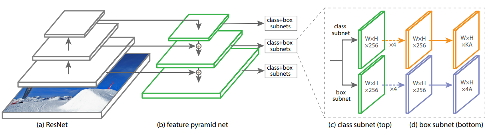

# Object detection reference training scripts

This folder contains reference training scripts for object detection.
They serve as a log of how to train specific models, to provide baseline
training and evaluation scripts to quickly bootstrap research.

To execute the example commands below you must install the following:

```
cython
pycocotools
matplotlib
```

You must modify the following flags:

`--data-path=/path/to/coco/dataset`

`--nproc_per_node=<number_of_gpus_available>`

Except otherwise noted, all models have been trained on 8x V100 GPUs. 


### RetinaNet
```
torchrun --nproc_per_node=8 train.py\
    --dataset coco --model retinanet_resnet50_fpn --epochs 26\
    --lr-steps 16 22 --aspect-ratio-group-factor 3 --lr 0.01 --weights-backbone ResNet50_Weights.IMAGENET1K_V1
```


**=====================================分割线=======================================**


本文为了方便学习整理，单独把RetinaNet文件简单提取出来，因此环境需要满足以下条件：

```
torch >= 1.11.0
torchvision >= 0.12.0
```

### 网络结构



### 算法总结
待补充......