# Object detection reference training scripts

This folder contains reference training scripts for object detection.
They serve as a log of how to train specific models, to provide baseline
training and evaluation scripts to quickly bootstrap research.

To execute the example commands below you must install the following:

```
cython
pycocotools
matplotlib
```

You must modify the following flags:

`--data-path=/path/to/coco/dataset`

`--nproc_per_node=<number_of_gpus_available>`

Except otherwise noted, all models have been trained on 8x V100 GPUs. 


### RetinaNet
```
torchrun --nproc_per_node=8 train.py\
    --dataset coco --model retinanet_resnet50_fpn --epochs 26\
    --lr-steps 16 22 --aspect-ratio-group-factor 3 --lr 0.01 --weights-backbone ResNet50_Weights.IMAGENET1K_V1
```


**=====================================分割线=====================================**


本文为了方便学习整理，单独把RetinaNet文件简单提取出来，因此环境需要满足以下条件：

```
torch >= 1.11.0
torchvision >= 0.12.0
```

### 网络结构


​																												图1 RetinaNet网络结构


#### 1 数据流程



​	**注：Head部分权重共享**


#### 2 Anchor生成

​		在RetinaNet中，通过backbone和FPN我们能够得到5级FPN feature map。假如原始图片大小为h, w=800, 1216，那么P3，P4，P5，P6，P7 5级 feature map的h, w分别为[100, 152]，[50, 76]，[25, 38]，[13, 19]，[7, 10]。对于feature map上的每一个点，映射回原图就是一个网格。因此我们一共得到20276个网格。RetinaNet在每个网格的中心点上都放置了9个不同长宽比、不同大小的先验框。因此Anchor的总数量为20276 x 9。需要注意的是每个网格上的9个先验框长宽都是一样的，只是框的中心点不同。 RetinaNet使用了三种长宽比和三种放大比例先生成了9种长宽组合：

```python
# mmmdection
anchor_generator=dict(
    type='AnchorGenerator',
    # 特征图 anchor 的 base scale, 值越大，所有 anchor 的尺度都会变大
    octave_base_scale=4,
    # 每个特征图有3个尺度，2**0, 2**(1/3), 2**(2/3)
    scales_per_octave=3,
    # 每个特征图有3个高宽比例
    ratios=[0.5, 1.0, 2.0],
    # 特征图对应的 stride，必须特征图 stride 一致，不可以随意更改
    strides=[8, 16, 32, 64, 128])
```


#### 3 BBox Assigner

​		计算得到输出特征图上面每个点对应的原图 anchor 坐标后，就可以和 gt 信息计算每个 anchor 的正负样本属性，对应配置如下：

```python
assigner=dict(
    # 最大 IoU 原则分配器
    type='MaxIoUAssigner',
    # 正样本阈值
    pos_iou_thr=0.5,
    # 负样本阈值
    neg_iou_thr=0.4,
    # 正样本阈值下限
    min_pos_iou=0,
    # 忽略 bboes 的阈值，-1表示不忽略
    ignore_iof_thr=-1)
```

(1) 初始化所有 anchor 为忽略样本

​		假设所有输出特征的所有 anchor 总数一共 n 个，对应某张图片中 gt bbox 个数为 m，首先初始化长度为 n 的 assigned_gt_inds，全部赋值为 -1，表示当前全部设置为忽略样本。

```python
# 1. assign -1 by default
assigned_gt_inds = overlaps.new_full((num_bboxes, ), -1, dtype=torch.long)
```

(2) 计算背景样本

​		将每个 anchor 和所有 gt bbox 计算 iou，找出最大 iou，如果该 iou 小于 neg_iou_thr 或者在背景样本阈值范围内，则该 anchor 对应索引位置的 assigned_gt_inds 设置为 0，表示是负样本(背景样本)

```python
# 每个先验框与所有真实框中IoU中的最大值m, 最大值对应的索引（即先验框所负责的真实框）
max_overlaps, argmax_overlaps = overlaps.max(dim=0)
# 这部分主要保证每个真实框至少有一个匹配的先验框
gt_max_overlaps, gt_argmax_overlaps = overlaps.max(dim=1)

# 2. assign negative: below
# the negative inds are set to be 0
if isinstance(self.neg_iou_thr, float):
    assigned_gt_inds[(max_overlaps >= 0) & (max_overlaps < self.neg_iou_thr)] = 0
```

(3) 计算高质量正样本

​		将每个anchor 和所有 gt bbox 计算 iou，找出最大 iou，如果其最大 iou 大于等于 pos_iou_thr，则设置该 anchor 对应所有的 assigned_gt_inds 设置为当前匹配 gt bbox 的编号 +1(后面会减掉 1)，表示该 anchor 负责预测该 gt bbox，且是高质量 anchor。之所以要加 1，是为了区分背景样本(背景样本的 assigned_gt_inds 值为 0)

```python
pos_inds = max_overlaps >= self.pos_iou_thr
assigned_gt_inds[pos_inds] = argmax_overlaps[pos_inds] + 1
```

(4) 适当增加更多正样本

​		在第三步计算高质量正样本中可能会出现某些 gt bbox 没有分配给任何一个 anchor (由于 iou 低于 pos_iou_thr)，导致该 gt bbox 不被认为是前景物体，此时可以通过 self.match_low_quality=True 配置进行补充正样本。

​		对于每个 gt bbox 需要找出和其最大 iou 的 anchor 索引，如果其 iou 大于 min_pos_iou，则将该 anchor 对应索引的 assigned_gt_inds 设置为正样本，表示该 anchor 负责预测对应的 gt bbox。通过本步骤，可以最大程度保证每个 gt bbox 都有相应的 anchor 负责预测，但是如果其最大 iou 值还是小于 min_pos_iou，则依然不被认为是前景物体。

```python
if self.match_low_quality:
    # Low-quality matching will overwirte the assigned_gt_inds assigned
    # in Step 3. Thus, the assigned gt might not be the best one for
    # prediction.
    # For example, if bbox A has 0.9 and 0.8 iou with GT bbox 1 & 2,
    # bbox 1 will be assigned as the best target for bbox A in step 3.
    # However, if GT bbox 2's gt_argmax_overlaps = A, bbox A's
    # assigned_gt_inds will be overwritten to be bbox B.
    # This might be the reason that it is not used in ROI Heads.
    for i in range(num_gts):
        if gt_max_overlaps[i] >= self.min_pos_iou:
            if self.gt_max_assign_all:
                #如果有多个相同最高 iou 的 anchor 和该 gt bbox 对应，则一并赋值
                max_iou_inds = overlaps[i, :] == gt_max_overlaps[i]
                # 同样需要加1
                assigned_gt_inds[max_iou_inds] = i + 1
            else:
                assigned_gt_inds[gt_argmax_overlaps[i]] = i + 1
```

从这一步可以看出，3 和 4 有部分 anchor 重复分配了，即当某个 gt bbox 和 anchor 的最大 iou 大于等于 pos_iou_thr，那肯定大于 min_pos_iou，此时 3 和 4 步骤分配的同一个 anchor，并且从上面注释可以看出本步骤可能会引入低质量 anchor，是否需要开启本步骤需要根据不同算法来确定。

再次回到 RetinaNet 的 bbox assigner 配置：

```python
assigner=dict(
    # 最大 IoU 原则分配器
    type='MaxIoUAssigner',
    # 正样本阈值
    pos_iou_thr=0.5,
    # 负样本阈值
    neg_iou_thr=0.4,
    # 正样本阈值下限
    min_pos_iou=0,
    # 忽略 bbox 的阈值，-1表示不忽略
    ignore_iof_thr=-1)
```

此时可以可以得到如下总结：

* 如果 anchor 和所有 gt bbox 的最大 iou 值小于 0.4，那么该 anchor 就是背景样本
* 如果 anchor 和所有 gt bbox 的最大 iou 值大于等于 0.5，那么该 anchor 就是高质量正样本
* 如果 gt bbox 和所有 anchor 的最大 iou 值大于等于 0(可以看出每个 gt bbox 都一定有至少一个 anchor 匹配)，那么该 gt bbox 所对应的 anchor 也是正样本
* 其余样本全部为忽略样本即 anchor 和所有 gt bbox 的最大 iou 值处于 [0.4,0.5) 区间的 anchor 为忽略样本，不计算 loss


#### 4 BBox Encoder Decoder

在 anchor-based 算法中，为了利用 anchor 信息进行更快更好的收敛，一般会对 head 输出的 bbox 分支 4 个值进行编解码操作，作用有两个：

1. 更好的平衡分类和回归分支 loss，以及平衡 bbox 四个预测值的 loss
2. 训练过程中引入 anchor 信息，加快收敛

```python
dx = (gx - px) / pw
dy = (gy - py) / ph
dw = torch.log(gw / pw)
dh = torch.log(gh / ph)
deltas = torch.stack([dx, dy, dw, dh], dim=-1)
# 最后减掉均值，处于标准差
means = deltas.new_tensor(means).unsqueeze(0)
stds = deltas.new_tensor(stds).unsqueeze(0)
deltas = deltas.sub_(means).div_(stds)
```

