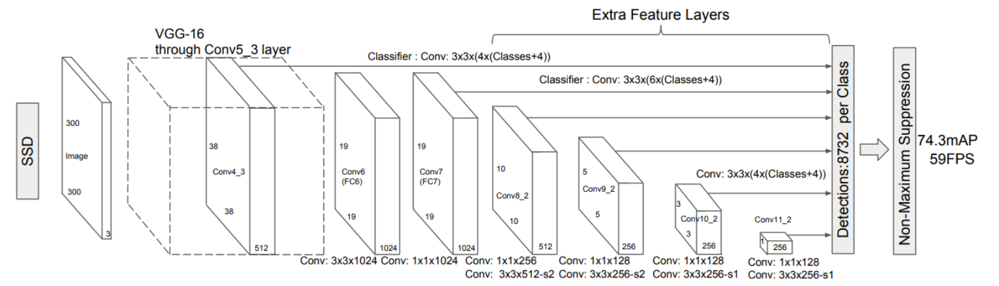

# Object detection reference training scripts

This folder contains reference training scripts for object detection.
They serve as a log of how to train specific models, to provide baseline
training and evaluation scripts to quickly bootstrap research.

To execute the example commands below you must install the following:

```
cython
pycocotools
matplotlib
```

You must modify the following flags:

`--data-path=/path/to/coco/dataset`

`--nproc_per_node=<number_of_gpus_available>`

Except otherwise noted, all models have been trained on 8x V100 GPUs.

### SSD300 VGG16
```
torchrun --nproc_per_node=8 train.py\
    --dataset coco --model ssd300_vgg16 --epochs 120\
    --lr-steps 80 110 --aspect-ratio-group-factor 3 --lr 0.002 --batch-size 4\
    --weight-decay 0.0005 --data-augmentation ssd --weights-backbone VGG16_Weights.IMAGENET1K_FEATURES
```

### SSDlite320 MobileNetV3-Large
```
torchrun --nproc_per_node=8 train.py\
    --dataset coco --model ssdlite320_mobilenet_v3_large --epochs 660\
    --aspect-ratio-group-factor 3 --lr-scheduler cosineannealinglr --lr 0.15 --batch-size 24\
    --weight-decay 0.00004 --data-augmentation ssdlite --weights-backbone MobileNet_V3_Large_Weights.IMAGENET1K_V1
```


**=====================================分割线=======================================**


本文为了方便学习整理，单独把RetinaNet文件简单提取出来，因此环境需要满足以下条件：

```python
torch >= 1.11.0
torchvision >= 0.12.0
```

#### 网络结构


**SSD的检测头权重不共享！！！**


#### 1 真实框的处理
真实框的处理可以分为两个部分，分别是：

* 找到真实框对应的先验框
* 对真实框进行编码

##### a. 先验框匹配

​		SSD的先验框与ground truth的匹配原则主要有两点。

* 首先，对于图片中每个ground truth，找到与其IOU最大的先验框，该先验框与其匹配，这样，可以保证每个ground truth一定与某个先验框匹配。通常称与ground truth匹配的先验框为正样本（其实应该是先验框对应的预测box，不过由于是一一对应的就这样称呼了），反之，若一个先验框没有与任何ground truth进行匹配，那么该先验框只能与背景匹配，就是负样本。一个图片中ground truth是非常少的， 而先验框却很多，如果仅按第一个原则匹配，很多先验框会是负样本，正负样本极其不平衡，所以需要第二个原则。

* 第二个原则是：对于剩余的未匹配先验框，若某个ground truth的 IOU大于某个阈值（一般是0.5），那么该先验框也与这个ground truth进行匹配。这意味着某个ground truth可能与多个先验框匹配，这是可以的。但是反过来却不可以，因为一个先验框只能匹配一个ground truth，如果多个ground truth与某个先验框  大于阈值，那么先验框只与IOU最大的那个ground truth进行匹配。第二个原则一定在第一个原则之后进行，仔细考虑一下这种情况，如果某个ground truth所对应最大IOU小于阈值，并且所匹配的先验框却与另外一个ground truth的IOU大于阈值，那么该先验框应该匹配谁，答案应该是前者，首先要确保某个ground truth一定有一个先验框与之匹配。

```python
# 所有真实框与先验框的IoU
match_quality_matrix = box_ops.box_iou(targets_per_image["boxes"], anchors_per_image)
# 找到与每个先验框IoU最大的真实框 从而负责其的预测
matched_vals, matches = match_quality_matrix.max(dim=0)
# Assign candidate matches with low quality to negative (unassigned) values
below_low_threshold = matched_vals < self.low_threshold
# 在SSD中这步不起作用
between_thresholds = (matched_vals >= self.low_threshold) & (matched_vals < self.high_threshold)
matches[below_low_threshold] = self.BELOW_LOW_THRESHOLD  # 去除IoU较小的
matches[between_thresholds] = self.BETWEEN_THRESHOLDS

# 其这一步其实是为保证每个真实框至少有一个与其相对应的先验框
_, highest_quality_pred_foreach_gt = match_quality_matrix.max(dim=1) 
matches[highest_quality_pred_foreach_gt] = torch.arange(
    highest_quality_pred_foreach_gt.size(0), dtype=torch.int64,
    device=highest_quality_pred_foreach_gt.device
)
```

##### b. 真实框的编码

​		将上述先验框与其相应真实框进行编码（操作同RetinaNet）

#### 2 相关阅读

**a. [目标检测|SSD原理与实现](https://zhuanlan.zhihu.com/p/33544892)**  
**b. [睿智的目标检测23——Pytorch搭建SSD目标检测平台](https://blog.csdn.net/weixin_44791964/article/details/104981486)**

